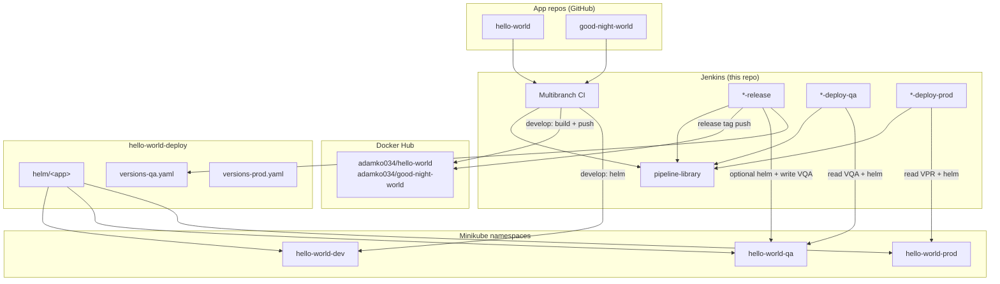
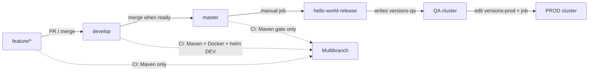

# Hello World sample — Jenkins CI/CD lab

Local Jenkins (Configuration as Code) that builds and deploys two Spring Boot
microservices to Minikube. Desired image tags for QA/PROD live in a shared
GitOps-style deploy repo; Jenkins applies Helm.

**Org:** [hello-world-sample](https://github.com/hello-world-sample)

| Repo | Role |
|------|------|
| [jenkins](https://github.com/hello-world-sample/jenkins) | This repo — Jenkins image, CasC, Job DSL |
| [jenkins-pipeline-library](https://github.com/hello-world-sample/jenkins-pipeline-library) | Shared pipeline steps (`microserviceCi`, `Release`, `DeployQa`, `DeployProd`) |
| [hello-world](https://github.com/hello-world-sample/hello-world) | App (port **1234**) |
| [good-night-world](https://github.com/hello-world-sample/good-night-world) | App (port **1235**) |
| [hello-world-deploy](https://github.com/hello-world-sample/hello-world-deploy) | Helm charts + `versions-qa.yaml` / `versions-prod.yaml` |

Docker images are pushed to Docker Hub under `adamko034/<app>` (separate from the GitHub org).

---

## Architecture



Both apps share the same namespaces (`hello-world-dev` / `hello-world-qa` / `hello-world-prod`).
They are separate Helm releases and Services (different ports).

---

## Journey: feature → PROD

Same flow for **hello-world** and **good-night-world**. Examples use `hello-world`.

### Overview



### 1. Feature branch — build & test only

1. Create `feature/…` from `develop` (or `master`, per your habit).
2. Push. In Jenkins, open **hello-world** multibranch → **Scan Multibranch Pipeline**
   (or wait if you add a webhook / periodic scan later).
3. **What runs:** `Jenkinsfile` → `microserviceCi`
   - `mvn clean compile`
   - `mvn test`
   - `mvn package -DskipTests`
4. **What does not run:** Docker build, Helm, GitOps writes.
5. Merge the feature into **develop** when ready.

**Trigger:** Multibranch branch indexing / manual scan (CasC suppresses *automatic*
builds from indexing so a Jenkins restart does not rebuild every branch).

---

### 2. Develop — continuous delivery to DEV

1. Merge / push to **develop**.
2. Multibranch job for branch `develop` runs.
3. **What runs:**
   1. Full Maven (compile → test → package).
   2. Read `project.version` from the POM (e.g. `0.0.4-SNAPSHOT`).
   3. `docker build` / `docker push` `adamko034/hello-world:0.0.4-SNAPSHOT`
      (multi-stage Dockerfile runs Maven again inside the image).
   4. Checkout **hello-world-deploy** into `deploy/`.
   5. `helm upgrade --install hello-world … -n hello-world-dev -f values-dev.yaml`
      with `--set image.repository` / `image.tag` and **`--wait`** (until pods Ready).
4. DEV uses `image.pullPolicy: Always` so re-pushed SNAPSHOT tags are actually pulled.

**Namespace:** `hello-world-dev` (from the app `Jenkinsfile` `namespace:` argument).

---

### 3. Master — release candidate gate

1. Merge **develop → master** (PR or local merge + push).
2. Multibranch `master` runs Maven only and prints that release is manual.
3. No Docker, no deploy from this job.

---

### 4. Release — version, image, tag, QA desired state

1. Run Jenkins job **hello-world-release** → *Build with Parameters*.
2. Parameters:
   - **BUMP:** `patch` | `minor` | `major` (from current master `x.y.z-SNAPSHOT`)
   - **DEPLOY_QA:** if checked, also Helm-deploy QA after updating the versions file
3. **What runs** (`Jenkinsfile.release` → `microserviceRelease`):
   1. Checkout **master**, Maven compile/test.
   2. Compute release version (e.g. `0.0.4-SNAPSHOT` + patch → `0.0.4`).
   3. `mvn versions:set` to release version → package → Docker push `:0.0.4`.
   4. Git commit + annotated tag `0.0.4` on master.
   5. Bump POM to next SNAPSHOT (`0.0.5-SNAPSHOT`), commit, push master + tag.
   6. Update **hello-world-deploy** `helm/versions-qa.yaml`:
      `hello-world: "0.0.4"` and push.
   7. If `DEPLOY_QA=true`: Helm to **hello-world-qa** with `--wait`.
   8. Merge **master → develop** and push develop (keeps SNAPSHOT line in sync).

**Trigger:** Manual only (pipeline job, not multibranch).

---

### 5. QA redeploy (optional)

Job **hello-world-deploy-qa** (no parameters):

1. Checkout deploy repo.
2. Read tag from `helm/versions-qa.yaml`.
3. Manual **Confirm** (shows file version vs current cluster tag).
4. Helm to `hello-world-qa` with `--wait`.

Use this to redeploy the *current* QA desired version (e.g. after a chart change),
or if release ran with `DEPLOY_QA=false`.

---

### 6. PROD

1. Set the desired tag in **hello-world-deploy** `helm/versions-prod.yaml`
   (today: edit & push; release does **not** auto-write PROD).
2. Run **hello-world-deploy-prod**.
3. Job reads `versions-prod.yaml`, asks for confirm, Helm to **hello-world-prod**
   + `--wait`.

---

## Jenkins jobs (CasC)

Created from [`casc/jenkins.yaml`](./casc/jenkins.yaml) on every Jenkins start:

| Job | Type | Script |
|-----|------|--------|
| `hello-world` / `good-night-world` | Multibranch | `Jenkinsfile` |
| `*-release` | Pipeline | `Jenkinsfile.release` |
| `*-deploy-qa` | Pipeline | `Jenkinsfile.deploy-qa` |
| `*-deploy-prod` | Pipeline | `Jenkinsfile.deploy-prod` |

Global shared library name: **`pipeline-library`** →
`hello-world-sample/jenkins-pipeline-library` (`main`).

App Jenkinsfiles only pass config, for example:

```groovy
@Library('pipeline-library') _

microserviceCi(
    app: 'hello-world',
    image: 'adamko034/hello-world',
    namespace: 'hello-world-dev'
)
```

---

## Environments & versions

| Env | Namespace | Image tag source | pullPolicy |
|-----|-----------|------------------|------------|
| DEV | `hello-world-dev` | POM SNAPSHOT from develop CI | `Always` |
| QA | `hello-world-qa` | `helm/versions-qa.yaml` | `IfNotPresent` |
| PROD | `hello-world-prod` | `helm/versions-prod.yaml` | `IfNotPresent` |

Charts: `hello-world-deploy/helm/<app>/` with `values-dev.yaml` / `values-qa.yaml` /
`values-prod.yaml`. CI always `--set image.repository` and `image.tag`.

---

## Run Jenkins locally

```bash
cd jenkins
docker volume create jenkins_home   # once
docker compose up -d --build
```

Open http://localhost:8080/

### Credentials to create in Jenkins UI

| ID | Type | Purpose |
|----|------|---------|
| `github-pat` | Username + password/token | Clone/push GitHub |
| `dockerhub-cred` | Username + password | Docker Hub push/pull |
| `minikube-kubeconfig` | Secret file | Helm/kubectl to Minikube |

Compose env (see [`docker-compose.yaml`](./docker-compose.yaml)) sets repo URLs for
CasC Job DSL (`GIT_REPO_URL`, `GOOD_NIGHT_GIT_REPO_URL`, `DEPLOY_GIT_REPO_URL`, …).

### Useful host setup

- Docker Desktop / Engine (Jenkins mounts `/var/run/docker.sock` — **lab shortcut**,
  not production-safe).
- Minikube running; kubeconfig stored as the credential above.
- Helm 3 is installed inside the Jenkins image.

---

## Local apps without Jenkins

From the parent workspace (not this repo):

```bash
docker compose up --build
```

- http://localhost:1234 — hello-world  
- http://localhost:1235 — good-night-world  

---

## Design notes (intentional)

- **GitOps-lite:** Jenkins writes desired tags to git *and* runs `helm upgrade`.
  There is no Argo CD/Flux reconciler.
- **Deploy with wait:** Every Helm apply uses `--wait` so the job fails if pods
  never become Ready (readiness probe).
- **PROD promote:** Updating `versions-prod.yaml` is still a human (or future job)
  step; deploy-prod only applies what is already in that file.
